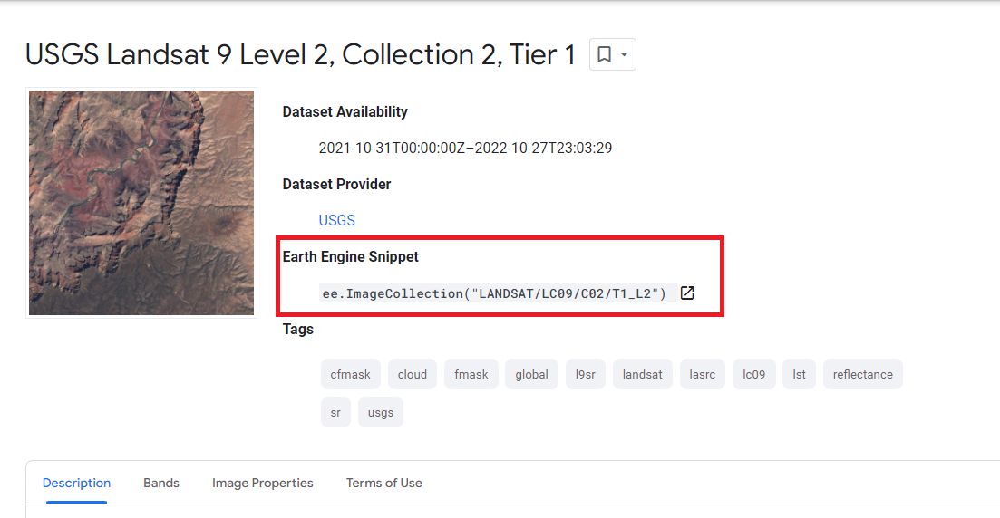

```{r setup, include=FALSE}
options(htmltools.dir.version = FALSE)
```

```{r xaringan-all, echo=FALSE}
library(countdown)
library(xaringan)
library(xaringanExtra)
library(knitr)

hook_source <- knitr::knit_hooks$get('source')
knitr::knit_hooks$set(source = function(x, options) {
  x <- stringr::str_replace(x, "^[[:blank:]]?([^*].+?)[[:blank:]]*#<<[[:blank:]]*$", "*\\1")
  hook_source(x, options)
})

xaringanExtra::use_tachyons()
xaringanExtra::use_broadcast()
xaringanExtra::use_freezeframe()
xaringanExtra::use_scribble()
#xaringanExtra::use_slide_tone()
xaringanExtra::use_search(show_icon = TRUE, auto_search = FALSE)
xaringanExtra::use_freezeframe()
xaringanExtra::use_clipboard()
xaringanExtra::use_tile_view()
xaringanExtra::use_panelset()
xaringanExtra::use_editable(expires = 1)
xaringanExtra::use_fit_screen()
xaringanExtra::use_extra_styles(
  hover_code_line = TRUE,         
  mute_unhighlighted_code = TRUE  
)

```

class: center, title-slide, middle

background-image: url("img/CASA_Logo_no_text_trans_17.png")
background-size: cover
background-position: center


<style>
.title-slide .remark-slide-number {
  display: none;
}
</style>


```{r load_packages, message=FALSE, warning=FALSE, include=FALSE}
library(fontawesome)
```

# Remotely Sensing Cities and Environments

### Lecture 5: An introduction to Google Earth Engine

### 28/10/2022 (updated: `r format(Sys.time(), "%d/%m/%Y")`)

`r fa("paper-plane", fill = "#562457")` [a.maclachlan@ucl.ac.uk](mailto:a.maclachlan@ucl.ac.uk)
`r fa("twitter", fill = "#562457")` [andymaclachlan](https://twitter.com/andymaclachlan)
`r fa("github", fill = "#562457")` [andrewmaclachlan](https://github.com/andrewmaclachlan)
`r fa("location-dot", fill = "#562457")` [Centre for Advanced Spatial Analysis, UCL](https://www.ucl.ac.uk/bartlett/casa/)
`r fa("file-pdf", fill = "#562457")` [PDF presentation](https://github.com/andrewmaclachlan/CASA0023-lecture-5/blob/main/index.pdf)

<a href="https://github.com/andrewmaclachlan" class="github-corner" aria-label="View source on GitHub"><svg width="80" height="80" viewBox="0 0 250 250" style="fill:#fff; color:#151513; position: absolute; top: 0; border: 0; left: 0; transform: scale(-1, 1);" aria-hidden="true"><path d="M0,0 L115,115 L130,115 L142,142 L250,250 L250,0 Z"></path><path d="M128.3,109.0 C113.8,99.7 119.0,89.6 119.0,89.6 C122.0,82.7 120.5,78.6 120.5,78.6 C119.2,72.0 123.4,76.3 123.4,76.3 C127.3,80.9 125.5,87.3 125.5,87.3 C122.9,97.6 130.6,101.9 134.4,103.2" fill="currentColor" style="transform-origin: 130px 106px;" class="octo-arm"></path><path d="M115.0,115.0 C114.9,115.1 118.7,116.5 119.8,115.4 L133.7,101.6 C136.9,99.2 139.9,98.4 142.2,98.6 C133.8,88.0 127.5,74.4 143.8,58.0 C148.5,53.4 154.0,51.2 159.7,51.0 C160.3,49.4 163.2,43.6 171.4,40.1 C171.4,40.1 176.1,42.5 178.8,56.2 C183.1,58.6 187.2,61.8 190.9,65.4 C194.5,69.0 197.7,73.2 200.1,77.6 C213.8,80.2 216.3,84.9 216.3,84.9 C212.7,93.1 206.9,96.0 205.4,96.6 C205.1,102.4 203.0,107.8 198.3,112.5 C181.9,128.9 168.3,122.5 157.7,114.1 C157.9,116.9 156.7,120.9 152.7,124.9 L141.0,136.5 C139.8,137.7 141.6,141.9 141.8,141.8 Z" fill="currentColor" class="octo-body"></path></svg></a><style>.github-corner:hover .octo-arm{animation:octocat-wave 560ms ease-in-out}@keyframes octocat-wave{0%,100%{transform:rotate(0)}20%,60%{transform:rotate(-25deg)}40%,80%{transform:rotate(10deg)}}@media (max-width:500px){.github-corner:hover .octo-arm{animation:none}.github-corner .octo-arm{animation:octocat-wave 560ms ease-in-out}}</style>

---

```{r, echo=FALSE}
xaringanExtra::use_progress_bar(color = "#0051BA", location = "bottom")
```

# How to use the lectures


- Slides are made with [xaringan](https://slides.yihui.org/xaringan/#1)

- `r fa("magnifying-glass")` In the bottom left there is a search tool which will search all content of presentation

- Control + F will also search 

- Press enter to move to the next result 

- `r fa("pencil")` In the top right let's you draw on the slides, although these aren't saved.

- Pressing the letter `o` (for overview) will allow you to see an overview of the whole presentation and go to a slide

- Alternatively just typing the slide number e.g. 10 on the website will take you to that slide

- Pressing alt+F will fit the slide to the screen, this is useful if you have resized the window and have another open - side by side. 

```{r xaringan-logo, echo=FALSE}
xaringanExtra::use_logo(
  image_url = "img/casa_logo.jpg",
  width = "50px",
  position = xaringanExtra::css_position(top = "1em", right = "2em")
)
```
---
# Lecture outline

.pull-left[

### Part 1: The setup of GEE

* 


### Part 2: GEE in action

* How we use it

]

.pull-right[
```{r echo=FALSE, out.width='100%'}
knitr::include_graphics('img/satellite.png')
```
.small[Source:[Original from the British Library. Digitally enhanced by rawpixel.](https://www.rawpixel.com/image/571789/solar-generator-vintage-style)
]]

---
class: inverse, center, middle

# What is Google Earth Engine


---

# Google Earth Engine 

.pull-left[

* "Geospatial" processing service
  * recall week 1 of CASA0005!

* It permits geospatial analysis **at scale**

* Scale ?
  * massive datasets
  * planetary scale analysis
  * really quickly (within seconds)
  
* Stores data on servers

* Takes the code you have written and applies it for you

* Can be used to make **queryable** online applications 
  
]
.pull-right[

<iframe width="560" height="315" src="https://www.youtube.com/embed/gKGOeTFHnKY" title="YouTube video player" frameborder="0" allow="accelerometer; autoplay; clipboard-write; encrypted-media; gyroscope; picture-in-picture" allowfullscreen></iframe>
]
---

# GEE terms (jargon?)

.pull-left[

Remember raster and vector data?

GEE has special names for them:

* Image = raster
  * Has bands
* Feature = vector 
  * Has geometry and attributes (dictionary of properties in GEE)
  
A stack of images (remember from R) is also called something new:

* Image stack= ImageCollection
* Feature stack (lots of polygons) = FeatureColletion
  
]

.pull-right[

```{r echo=FALSE, out.width='100%', fig.align='center'}

```

]

---

# GEE Javascript 

* GEE uses Javascript
  * Website programming language

* You will see some similarities to python and R but there are some notable differences 

  * Variables (or objects) as defined with `var`..
  * The a specific part of your code ends with a `;`
  * Objects are dictionaries in Javascript...
  
```{r, eval=FALSE}
// Use curly brackets {} to make a dictionary of key:value pairs.
var object = {
  foo: 'bar',
  baz: 13,
  stuff: ['this', 'that', 'the other thing']
};

print('Print foo:', object['foo']);
```

.small[Introduction to JavaScript for Earth Engine. Source: [GEE](https://developers.google.com/earth-engine/tutorials/tutorial_js_01)
]
  
---

# Client vs server side

.pull-left[


* Within GEE we have code that runs on the client side 
  * This is the browser
  
* We have code that runs on the server side
  * This is **on the server where data is stored**...
  
In GEE we have **Earth Engine Objects** = starting with `ee`, for example...

`ee.ImageCollection("LANDSAT/LC09/C02/T1_L2")`

]

.pull-right[

```{r echo=FALSE, out.width='100%', fig.align='center'}
knitr::include_graphics('img/client_server.jpg')
```

.small[Client vs Server side. Source: [pintrest/codeboxx](https://www.pinterest.co.uk/pin/764837949191948083/)
]

]

---


# Client vs server side...what does this mean...

.pull-left[

In practice i don't think about this much...

* Anything that has **`ee` in front of it is stored on the server**

* It has no data in your script. Recall in R the data environments, this would be empty.

* They are termed "proxy objects"

  > the agency, function, or office of a deputy who acts as a substitute for another

* Any pre-loaded data product will be on the server side...

]


.pull-right[


```{r echo=FALSE, out.width='100%', fig.align='center'}

```

.small[Data Explorer. Source: [GEE](https://earthengine.google.com/platform/)
]
]

---

# Client vs server side...problems...


* Looping

  * You can't (or shouldn't) use a loop for something on the server
  * The loop doesn't know what is in the ee object!

* Mapping functions
  
  * Instead we can create a function and save it into an object (or variable here)
  * Then apply it to everything on the server
  * Same idea as `map()` in R from the purrr package. 

* Server side **functions**

  * Same as the data.
  * `ee.Thing.method()`
  * **Saved** function on the sever that can be run without mapping
  
---


class: inverse, center, middle

## Scale on the first slide referred to the volume of analysis

## Scale here refers to pixel resolution 

---

# Scale

.pull-left[

* Image scale in GEE refers to pixel resolution.  

* In GEE the scale (resolution) is set by the **output not input**

* When you are doing analysis 

  * GEE aggregates the image to fit a 256x256 grid
  * Earth Engine selects the pyramid with the closest scale to that of your analysis (or specified by it) and resamples as needed
  * resampling uses nearest neighbor by default

**Set your scale**

]


.pull-right[

```{r echo=FALSE, out.width='100%', fig.align='center'}
knitr::include_graphics('img/Pyramids.png')
```

.small[Scale. Source: [GEE](https://developers.google.com/earth-engine/guides/scale)
]
]

---

# Scale example

Take an image and have a look at it...

```{r, eval=FALSE}
var image = ee.Image('LANDSAT/LC08/C01/T1/LC08_044034_20140318');

var rgbVis = {
  bands: ['B4', 'B3', 'B2'],
  min: 5964.56,
  max: 11703.44
};

Map.addLayer(image, rgbVis, "Landsat 8");
```

.small[Scale. Source: [GEE](https://developers.google.com/earth-engine/guides/scale)]

---

# Scale example 2

* Select a band and then change the scale
* Explore the values...

```{r, eval=FALSE}
var band_4 = image.select('B4');

var printAtScale = function(scale) {
  print('Pixel value at '+scale+' meters scale',
    band_4.reduceRegion({
      reducer: ee.Reducer.first(),
      geometry: band_4.geometry().centroid(),
      // The scale determines the pyramid level from which to pull the input
      scale: scale
  }).get('B4'));
};

printAtScale(10); // 8883
printAtScale(30); // 8883
printAtScale(50); // 8337
printAtScale(70); // 9215
printAtScale(200); // 8775
printAtScale(500); // 8300
```

.small[[Code example](https://code.earthengine.google.com/82d6c28210a115f2446c0ca8e7a65e51)]

---

class: inverse, center, middle

## Why are the values different

--

## Earth engine is aggregating the values based on your analysis (or specified scale)

---


# Projections

.pull-left[
* You do not need to worry about projects in GEE

* GEE converts all data into the Mercator projection (EPSG: 3857) when displayed
  * Specifically: WGS 84 / Pseudo-Mercator -- Spherical Mercator, Google Maps, OpenStreetMap, Bing, ArcGIS, ESRI
  
* The operations of the proejction are determined by the output - so it works out what you need and gives it to you! 

* You force set the projection, but there is no real reason to do this.

]

.pull-right[
```{r echo=FALSE, out.width='80%', fig.align='center'}

```

.small[Flow chart of operations corresponding to the display of a MODIS image in the Code Editor map. Projections (left side of flow chart) of each operation are determined from the output. Curved lines indicate the flow of information to the reprojection: specifically, the output projection and scale. Source: [GEE](https://developers.google.com/earth-engine/guides/projections)
]


]
---

# Building blocks of GEE

.pull-left[

**Objects**

* Object = vector, raster, feature, string, number

* Each of these belongs to a **class**

* Each **class** has specific GEE functions (or **methods**) for it...

]


.pull-right[
```{r echo=FALSE, out.width='100%', fig.align='center'}
knitr::include_graphics('img/GEE_object_classes.png')
```

.small[Object classes. Source: [GEE](https://developers.google.com/earth-engine/guides/objects_methods_overview)
]


]
---

# An example...image collection


* An image collection is a **stack** or rasters...

* It is loaded with the function specific to image collections...


```{r, eval=FALSE}
var dataset = ee.ImageCollection('LANDSAT/LC09/C02/T1_L2');

print(oneimage, "oneimage");

```

* But this is too many images and gives...

```{r echo=FALSE, out.width='80%', fig.align='center'}

```


---
# An example...image collection

* We could filter on the dates....but this is still providing Landsat data for the **whole world**

```{r, eval=FALSE}
var oneimage = ee.ImageCollection('LANDSAT/LC09/C02/T1_L2')

  .filterDate('2022-01-03', '2022-04-04');
```

* So we get the same error!

```{r echo=FALSE, out.width='80%', fig.align='center'}

```

---

# An example...image collection

* We can add a dates and region filter....! This is where it intersects the bounds..

```{r, eval=FALSE}
var oneimage = ee.ImageCollection('LANDSAT/LC09/C02/T1_L2')
  .filterDate('2022-01-03', '2022-04-04')
  .filterBounds(Dheli);  // Intersecting ROI
```

```{r echo=FALSE, out.width='50%', fig.align='center'}

```

---

# An example...image collection

Now, we can also add this to the map to see it

```{r, eval=FALSE}
var oneimage = ee.ImageCollection('LANDSAT/LC09/C02/T1_L2')
  .filterDate('2022-01-03', '2022-04-04')
  .filterBounds(Dheli);  // Intersecting ROI

Map.addLayer(oneimage, {bands: ["SR_B4", "SR_B3", "SR_B2"]})
```


```{r echo=FALSE, out.width='80%', fig.align='center'}

```


---

class: inverse, center, middle

##  So here we have:

### Raster data (lots of images)

### They belong to an imagecollection (as there are lots of images)

### We use the specific function (method or "constructor") to load and manipulate 

---

# An example...geometries and features 

.pull-left[

* Geometry = point/line/polygon with **no attributes**
  * Note you can also have MultiPolygon or MultiGeometry
  
* Feature = geometry **with attributes**

* Feature collection = **several features with** attributes 

]


.pull-right[

```{r echo=FALSE, out.width='100%', fig.align='center'}
knitr::include_graphics('img/GEE_object_classes.png')
```

.small[Object classes. Source: [GEE](https://developers.google.com/earth-engine/guides/objects_methods_overview)
]

]

---
# An example...geometries and features 

To load a feature collection....print the summary and then add it to the map..

```{r, eval=FALSE}
var india = ee.FeatureCollection('users/andrewmaclachlan/india');

print(india, "india");

Map.addLayer(india, {}, "india");
```

.pull-left[
```{r echo=FALSE, out.width='80%', fig.align='center'}

```
]


.pull-right[
```{r echo=FALSE, out.width='100%', fig.align='center'}

```

]

---
# An example...geometries and features 

We can filter the collection to just one polygon, in a similar method to the image collection...

```{r, eval=FALSE}
var india = ee.FeatureCollection('users/andrewmaclachlan/india')
    .filter('GID_1 == "IND.25_1"');
```


---

# What does GEE look like

```{r echo=FALSE, out.width='100%', fig.align='center'}
knitr::include_graphics('img/Code_editor_diagram.png')
```

---

# What typical processes can i do in GEE?

* Geometry operations (e.g. spatial operations)
  * Joins
  * Zonal statistics (e.g. average temperature per neighbourhood)
  * Filtering of images or specific values

* Methods
  * Machine learning 
  * Supervised and unsupervised classification 
  * Deep learning with Tensor Flow
  * Exploring relationships between variables 

> Machine learning and deep learning are both types of AI. Deep learning is a subset of machine learning that uses artificial neural networks to mimic the learning process of the human brain

* Applications/outputs
  * Online charts
  * Scalable geospatial [applications with GEE data](https://github.com/philippgaertner/awesome-earth-engine-apps)
  * These let us query the data with a user inteface that then updates the results


---

# Reducing images


This is combines the previous two ideas....

* In the first instance we load an image collection from a dates and place
  * Think about how we could do this in R (select, filter from `dplyr`)

* We want to reduce the collection to the extreme values for each pixel 
  * Provide me the median value for each pixel from the collection
  * `collection.reduce` is a client side function but it always calls a server side function in `ee.Reducer`
  
  
```{r, eval=FALSE}
// Load an image collection, filtered so it's not too much data.
var collection = ee.ImageCollection('LANDSAT/LT05/C01/T1')
  .filterDate('2008-01-01', '2008-12-31')
  .filter(ee.Filter.eq('WRS_PATH', 44))
  .filter(ee.Filter.eq('WRS_ROW', 34));

// Compute the median in each band, each pixel.
// Band names are B1_median, B2_median, etc.
var median = collection.reduce(ee.Reducer.median());

```
---

# Reducing images by region

.pull-left[

One of the most useful functions we can use here is termed **zonal statistics** --- we saw this briefly in CASA0005.

In GEE this is termed `reduceRegion()`

in the first instance I might want to take an image and generate some statistics for it - e.g. the average reflectance for each band within the study area
]

.pull-right[
```{r echo=FALSE, out.width='100%', fig.align='center'}
knitr::include_graphics('img/Reduce_region_diagram.png')
```
.small[Statistics of an Image Region. Source: [GEE](https://developers.google.com/earth-engine/guides/reducers_reduce_region)
]
]

---

# Reducing images by region

GEE example...

```{r, eval=FALSE}
// Load input imagery: Landsat 7 5-year composite.
var image = ee.Image('LANDSAT/LE7_TOA_5YEAR/2008_2012');

// Load an input region: Sierra Nevada.
var region = ee.Feature(ee.FeatureCollection('EPA/Ecoregions/2013/L3')
  .filter(ee.Filter.eq('us_l3name', 'Sierra Nevada'))
  .first());

// Reduce the region. The region parameter is the Feature geometry.
var meanDictionary = image.reduceRegion({
  reducer: ee.Reducer.mean(),
  geometry: region.geometry(),
  scale: 30,
  maxPixels: 1e9
});

// The result is a Dictionary.  Print it.
print(meanDictionary);
```

.small[Reducer. Source: [GEE](https://developers.google.com/earth-engine/guides/reducers_reduce_region)]

---

# Reducing images by region(s)

What if we want to use a **feature collection (with many polygons)**...same idea...but with `image.reduceRegions()`

Note, the scale parameter.

```{r, eval=FALSE}
// Load input imagery: Landsat 7 5-year composite.
var image = ee.Image('LANDSAT/LE7_TOA_5YEAR/2008_2012');

// Load a FeatureCollection of counties in Maine.
var maineCounties = ee.FeatureCollection('TIGER/2016/Counties')
  .filter(ee.Filter.eq('STATEFP', '23'));

// Add reducer output to the Features in the collection.
var maineMeansFeatures = image.reduceRegions({
  collection: maineCounties,
  reducer: ee.Reducer.mean(),
  scale: 30,
});

```

.small[Reducers. Source: [GEE](https://developers.google.com/earth-engine/guides/reducers_reduce_regions)]

---

# Reducing images by neighbourhood

* Instead of using a polygon to reduce our collection we can use the image neighbourhood
  * A window of pixels surrounding a central pixel
  * Like a filter or texture measure 
  * Although texture (from previous weeks) has its own function 

```{r echo=FALSE, out.width='40%', fig.align='center'}

```
.small[Statistics of Image Neighborhoods. Source: [GEE](https://developers.google.com/earth-engine/guides/reducers_reduce_neighborhood)
]


---

# Reducing images by neighbourhood 2


```{r, eval=FALSE}
// Define a region in the redwood forest.
var redwoods = ee.Geometry.Rectangle(-124.0665, 41.0739, -123.934, 41.2029);

// Load input NAIP imagery and build a mosaic.
var naipCollection = ee.ImageCollection('USDA/NAIP/DOQQ')
  .filterBounds(redwoods)
  .filterDate('2012-01-01', '2012-12-31');
var naip = naipCollection.mosaic();

// Compute NDVI from the NAIP imagery.
var naipNDVI = naip.normalizedDifference(['N', 'R']);

// Compute standard deviation (SD) as texture of the NDVI.
var texture = naipNDVI.reduceNeighborhood({
  reducer: ee.Reducer.stdDev(),
  kernel: ee.Kernel.circle(7),
});

```
---
# Reducing images by neighbourhood 3

```{r echo=FALSE, out.width='100%', fig.align='center'}

```
.small[Statistics of an Image Region. Source: [GEE](https://developers.google.com/earth-engine/guides/reducers_reduce_region)
]

---
# Recall regression....

.pull-left[

We will see this **three times** throughout the next few slides...

$$y_i = \beta_0 + \beta_1x_i + \epsilon_i$$

where:

$\beta_0$ is the intercept (the value of $y$ when $x = 0$)

$\beta_1$ the 'slope'  the change in the value of $y$ for a 1 unit change in the value of $x$ (the slope of the blue line)

$\epsilon_i$ is a random error term (positive or negative) - if you add all of the vertical differences between the blue line and all of the residuals, it should sum to 0.

Any value of $y$ along the blue line can be modeled using the corresponding value of $x$ 

]
.pull-right[

```{r echo=FALSE, out.width='100%', fig.align='center'}
knitr::include_graphics('img/regression.png')
```
.small[Source:[CASA0005](https://andrewmaclachlan.github.io/CASA0005repo/explaining-spatial-patterns.html#analysing-gcse-exam-performance---testing-a-research-hypothesis)
]

what are the factors that might lead to variation in Average GCSE point scores:
* independent **predictor** variable (unauthorised absence)
* dependent variable (GCSE point score)
]

---

# Linear regression 1

The real benefit of GEE is being able to access **all** imagery for multiple sensors...

What if we wanted to see **the change over time in pixel values** - `linearFit()`

`linearFit()` takes a least squares approach of one variable. 2 bands:
  * Band 1: dependent variable 
  * Band 2: independent variable (often time)

This runs of a **per pixel** basis

This is still considered a **reducer** as we are reducing all of the data to two images:
* Offset - intercept 
* Scale - line of the slope


---

# Linear regression 2

```{r, eval=FALSE}
// Define a region in the redwood forest.
var redwoods = ee.Geometry.Rectangle(-124.0665, 41.0739, -123.934, 41.2029);

// Load input NAIP imagery and build a mosaic.
var naipCollection = ee.ImageCollection('USDA/NAIP/DOQQ')
  .filterBounds(redwoods)
  .filterDate('2012-01-01', '2012-12-31');
var naip = naipCollection.mosaic();

// Compute NDVI from the NAIP imagery.
var naipNDVI = naip.normalizedDifference(['N', 'R']);

// Compute standard deviation (SD) as texture of the NDVI.
var texture = naipNDVI.reduceNeighborhood({
  reducer: ee.Reducer.stdDev(),
  kernel: ee.Kernel.circle(7),
});

```

.small[Linear Regression. Source: [GEE](https://developers.google.com/earth-engine/guides/reducers_regression)
]
---

# Linear regression 3

```{r echo=FALSE, out.width='75%', fig.align='center'}

```

Increased precipitation are shown in blue and decreased precipitation in red (from the slope of the line)

.small[Linear Regression. Source: [GEE](https://developers.google.com/earth-engine/guides/reducers_regression)
]

---

# Linear regression 4

.pull-left[

We can use additional variables like we have seen before, including multiple dependent variables...this is termed **Multivariate Multiple Linear Regression**

This just does the same as OLS for both of the dependent variables 

In the GEE example...

precip + temp *are modelled by* a control variable (this means the intercept) and time. 

The only difference is with a covariance matrix, see this [towardsdatascience article from section 2](https://towardsdatascience.com/5-things-you-should-know-about-covariance-26b12a0516f1)
]

.pull-right[

```{r echo=FALSE, out.width='75%', fig.align='center'}

```

.small[Multivariate Multiple Linear Regression. Source: [statstest](https://www.statstest.com/multivariate-multiple-linear-regression/)
]
]

---

# Linear regression 5

You can combine reducers for regression, for example:

* Regression per pixels (typically with an image collection over several years)

* Regression of all the values within a polygon (taking an image of 1 date, extracting all the pixels and then running regression)

In **GEE** you must add a constant as an independent variable for **the intercept (unless you want it to be 0)**

In the following example, precip + temp *are modelled by* a control variable (this means the intercept) and time. 

So where predicted temp and time increase per pixel then the coefficient will be positive

.small[Linear Regression. Source: [GEE](https://developers.google.com/earth-engine/guides/reducers_regression)
]

---
# Linear regression 6


.pull-left[
```{r, eval=FALSE}
// Load the input image collection: projected climate data.
var collection = ee.ImageCollection('NASA/NEX-DCP30_ENSEMBLE_STATS')
  .filterDate(ee.Date('2006-01-01'), ee.Date('2099-01-01'))
  .filter(ee.Filter.eq('scenario', 'rcp85'))
  // Map the functions over the collection, to get constant and time bands.
  .map(createTimeBand)
  .map(createConstantBand)
  // Select the predictors and the responses.
  .select(['constant', 'system:time_start', 'pr_mean', 'tasmax_mean']);

// Compute ordinary least squares regression coefficients.
var linearRegression = collection.reduce(
  ee.Reducer.linearRegression({
    numX: 2,
    numY: 2
}));

```

]

.pull-right[

```{r, eval=FALSE}

model1 <- Regressiondata %>%
  lm(average_gcse_capped_point_scores_2014 ~
               unauthorised_absence_in_all_schools_percent_2013,
     data=.)
```
]
---

# Joins

Joins in GEE are similar to joins in R (think left_join()) BUT

* We can join image collections (e.g. satellite data from January with data from October)

* We can join feature collections (e.g. different polygons)

To use joins we have to put them within a filter (`ee.Filter`)

* The `leftField` is the index (or attribute) in the primary data
* The `rightField` is the secondary data
* We set the **type of join** (e.g. 
    * simple: primary matches any in secondary 
    * inverted: retain those in primary that are not in secondary 
    * inner: shows all matches between collections as a feature collection
    * )
* We then combine (or join) with `join.apply()`

---
# Joins 2

We can also do a spatial join....remember back to [CASA0005](https://andrewmaclachlan.github.io/CASA0005repo/detecting-spatial-patterns.html#spatial-joining-1)

In the following code I have added to the GEE example:

* Select a national park
* Add all power plants within 100km of the park as a property **to the feature** (Yosemite here)...

[Code](https://code.earthengine.google.com/581dbded03c04d29cff8ec3d39ac3471)

---

# Joins 3

We can also intersect! 

* Select a polygon (national park)
* Return the intersection of the points within each polygon(s) (e.g. all national parks)

And finally spatially subset

* Select the power plants 
* Subset power plants within a polygon.

---
class: center, middle

# Machine learning


<iframe width="560" height="315" src="https://www.youtube.com/embed/WvaBZbph_cU?start=152" title="YouTube video player" frameborder="0" allow="accelerometer; autoplay; clipboard-write; encrypted-media; gyroscope; picture-in-picture; web-share" allowfullscreen></iframe>


```{r include=FALSE}
library(xaringanBuilder)
#build_pdf("index.html", complex_slides = TRUE)
```
